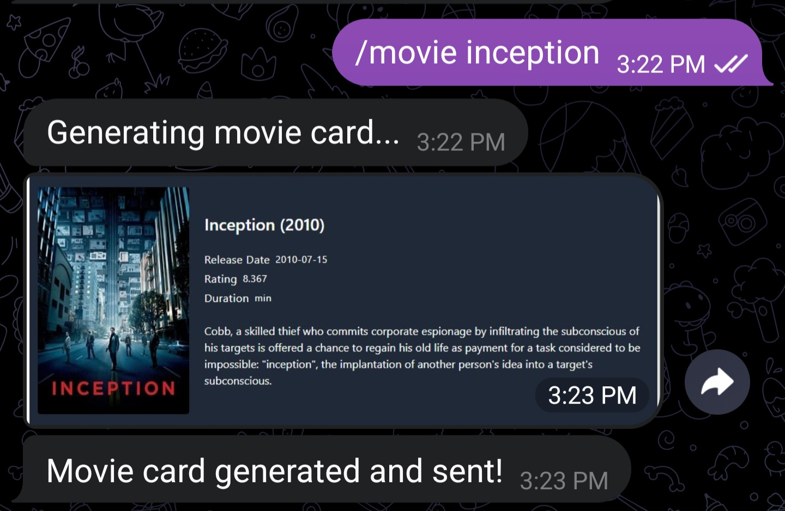

# Telegram Bot - Movie Card Generator Using TMDB API

This Telegram bot integrates with the TMDB API (The Movie Database) to fetch movie data based on user prompts. It generates a movie card using a simple web template and sends it back to the user. Please note that the bot is currently unstable and has several known issues. However, it is intended to be maintained and improved in the future.

#Example


## Prerequisites

Before using the bot, you need to obtain the following:

- API key from TMDB: Create an account on the TMDB website ([https://www.themoviedb.org/](https://www.themoviedb.org/)) and generate an API key. This key is required to make requests to the TMDB API for movie data.

- Telegram bot token: Create a Telegram bot and obtain a bot token from the BotFather. Follow the Telegram documentation ([https://core.telegram.org/bots#botfather](https://core.telegram.org/bots#botfather)) to create a new bot and obtain the token.

## Usage

1. Clone this repository.

2. Install the required dependencies:

   ```shell
   pip install requirements.txt
   ```

3. Replace the placeholders in the code with your actual API key and bot token:

   - Replace the `api_key` parameter in the `url` variable (`https://api.themoviedb.org/3/search/movie?api_key=YOUR_API_KEY`) with your TMDB API key.

   - Replace the `bot_token` variable (`bot_token = "YOUR_BOT_TOKEN"`) with your Telegram bot token.

4. Start the Flask application by running the code. The Flask application will be accessible at [http://127.0.0.1:5000/](http://127.0.0.1:5000/).

5. Start the Telegram bot using the provided bot token.

6. Interact with the bot by sending the `/movie [movie name]` command to generate a movie card.
